# Monitoring Example Workflows

This document contains mermaid diagrams illustrating the workflow of each example in the monitoring_example.py file.

## Example 1: Passive Monitoring

This example demonstrates basic monitoring without message injection - the monitor just observes and logs.

```mermaid
sequenceDiagram
    participant User
    participant MainAgent
    participant Runner
    participant Session
    participant Monitor
    
    Note over Monitor: Background Task Started
    
    User->>Runner: "What is 2+2?"
    Runner->>MainAgent: Process message
    MainAgent->>Session: Add user message event
    
    par Main Thread
        MainAgent->>MainAgent: Generate response
        MainAgent->>Session: Add model response event
        MainAgent->>Runner: Stream response
        Runner->>User: "4"
    and Background Monitor Loop
        loop Every 1 second
            Monitor->>Session: get_session()
            Session->>Monitor: Return session with events
            Monitor->>Monitor: Compare event count
            alt New events detected
                Monitor->>Monitor: Extract new events
                Monitor->>Monitor: Analyze events
                Note over Monitor: 📝 Log: "Monitor detected text"
                Note over Monitor: 🔧 Log: "Tool calls detected"
                Note over Monitor: 📊 Log: "Session state"
            end
        end
    end
    
    Note over Monitor: Monitor stopped (no injection)
```

## Example 2: Message Injection via Runner

This example shows how to detect risky patterns and inject warning messages into the chat.

## Example 3: Monitoring Agent Pattern (AI Monitors AI)

This example uses a separate AI agent to analyze the main agent's conversation and provide insights.

## Example 4: Real-World Multi-Turn Scenario

This example demonstrates coordinated monitoring across multiple conversation turns with dynamic intervention limits.

```mermaid
sequenceDiagram
    participant User
    participant Agent
    participant Runner
    participant Session
    participant Monitor
    
    Note over Monitor: Background monitoring started<br/>Max interventions: 2
    
    rect rgb(200, 220, 240)
        Note over User,Monitor: Turn 1: Setup Authentication
        User->>Runner: "How do I set up authentication?"
        Runner->>Agent: Process query
        Agent->>Session: Add user event
        
        par Main Thread
            Agent->>Agent: Generate response
            Agent->>Session: Add model response
            Agent->>Runner: Stream response
            Runner->>User: Display response
        and Background Monitor
            loop Monitor Loop
                Monitor->>Session: get_session()
                Session->>Monitor: Return events
                Monitor->>Monitor: Check for sensitive patterns
                Note over Monitor: No "password", "api key", "secret"<br/>in response → OK
            end
        end
    end
    
    rect rgb(250, 220, 220)
        Note over User,Monitor: Turn 2: API Key Example
        User->>Runner: "Show me example with API keys?"
        Runner->>Agent: Process query
        Agent->>Session: Add user event
        
        par Main Thread
            Agent->>Agent: Generate response
            Note over Agent: Response mentions "API key"
            Agent->>Session: Add model response
            Agent->>Runner: Stream response
            Runner->>User: Display response
        and Background Monitor
            loop Monitor Loop
                Monitor->>Session: get_session()
                Session->>Monitor: Return events
                Monitor->>Monitor: Analyze new events
                
                alt Sensitive data detected
                    Note over Monitor: 🔒 "api key" detected!
                    Monitor->>Monitor: intervention_count++
                    Monitor->>Monitor: Return security reminder
                    Note over Monitor: "Never share actual API keys"
                    Note over Monitor: Could inject via runner here
                end
            end
        end
    end
    
    Note over User: Delay for monitor processing (0.5s)
    
    Note over Monitor: Monitor stopped<br/>Total interventions: 1
```

## Architecture Overview: AgentMonitor Class

## Key Patterns Comparison

## Message Flow: How Injection Works

